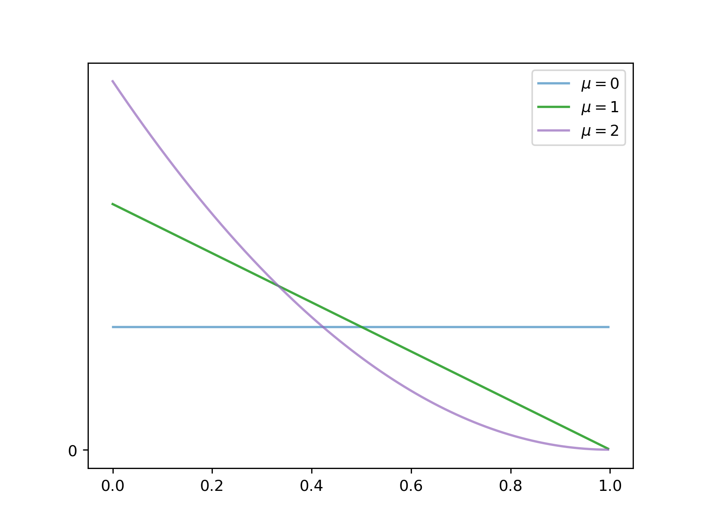
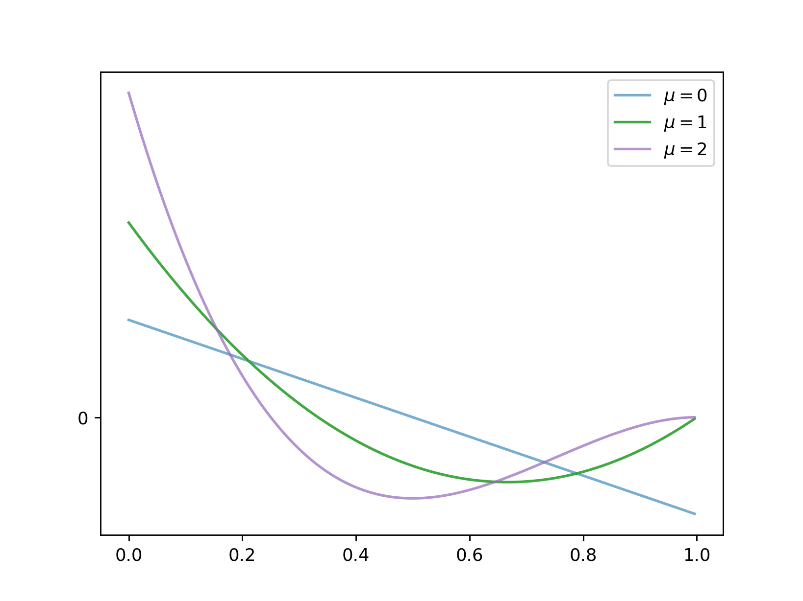
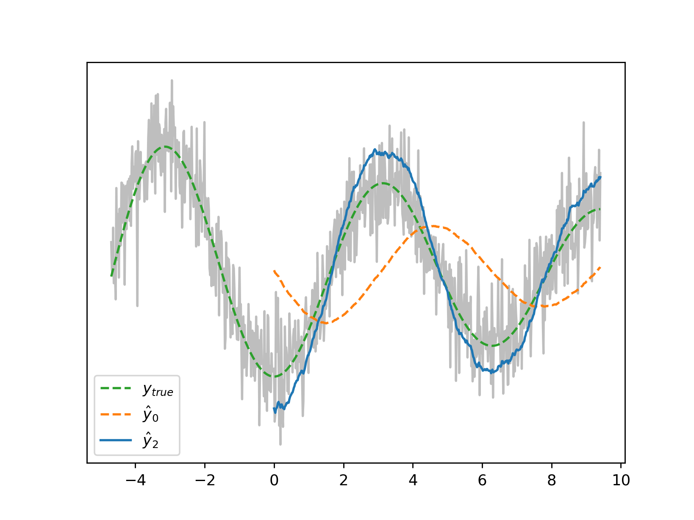
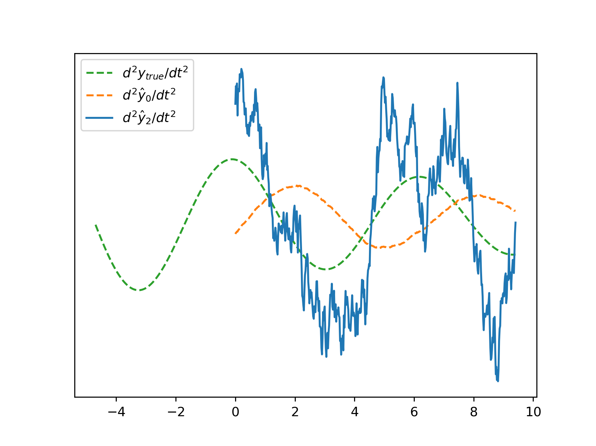
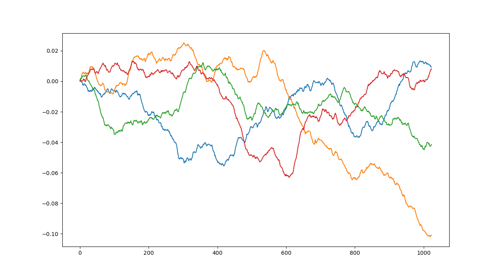
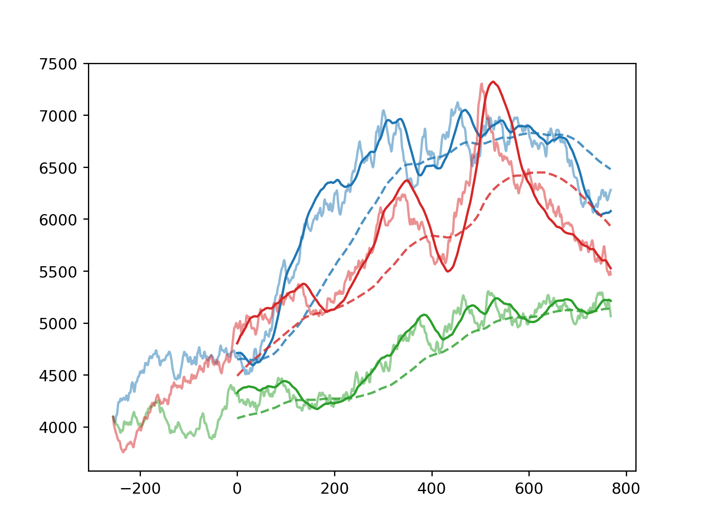
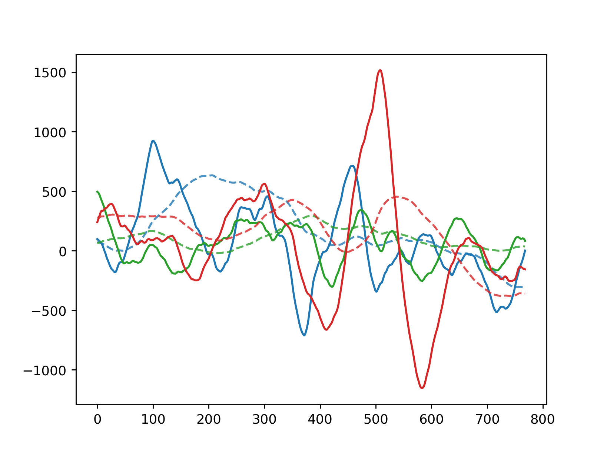

# Zero-Delay Filter

A Finite Impulse Response filter designed to minimize the usual lag when filtering noisy time series as well as compute derivatives of any order. 

## The Five Stages of Filtering

**EMA**: It occurred to you without even knowing that it was a thing. A little bit of the new value and a lot of what you've already accumulated, *et voila*. 

**GARCH**: You were inspired by the dusty office copy of Hamilton's [Time Series Analysis](https://press.princeton.edu/books/hardcover/9780691042893/time-series-analysis) one afternoon and figured you'd better step up your game to incorporate some autoregressive error terms. Slightly let down at the complete lack of predictive power though...

**Kalman**: So you stumbled into some internal degrees of freedom. Seemed exciting, until you'd coerced your equations into state space form, linearized your dynamics, extended and unscented your flavour and guessed your covariances... at that point *it* was making *you* do all the work. 

**Wavelets**: So many to choose from, such nice scaling properties and when it comes to time vs frequency, who doesn't like a scoop of each? You had to cut them in half to anti-node the incoming data though, and it was about then that you got distracted by Ehlers' [MAMA filter](https://www.mesasoftware.com/papers/MAMA.pdf). We won't talk about the brief romance with RNNs and besides, some guy at work had coded up something he called the Awesome Filter...

**EMA**: ...which turned out awesomeless. You drifted back to the EMA safe space, and for good reason: super efficient to calculate, stateless, and somehow spiritually significant as the maximum-entropy form for a single constraint. 

### But oh the Lag. 

It's just so *slow*. Sure, you're mostly looking at noise, but there's got to be *some* signal in there that you could Taylor-extrapolate surely? Speaking of which, it would be nice if we could actually get our hands on those derivatives. While you'll be keeping the marketing team happy with some zeroth derivatives for their glossy charts, the portfolio optimization guys are hankering after the first derivative and the market making guys keep hounding you for the second. 

## Numerical Differentiation

For these reasons we were intrigued by the work of [Mboup et al](https://link.springer.com/article/10.1007/s11075-008-9236-1). They show how a Jacobi polynomial basis emerges quite naturally from consideration of the derivatives in a filtering context, where the two shape parameters are $\mu$ and $\kappa$. The former we will take to be a kind of timescale parameter and the latter we will mostly set to zero. Let's take a look at the zeroth derivative filter for small values of $\mu$:

For these so-called *minimal* filters, the induced delay is 
$\frac{\kappa + n + 1}{\mu + \kappa + 2(n+1)}\cdot{L}$
where $L$ is the filter length and $n$ the derivative order. The delay is reduced as $\mu$ increases - that's why we regard it as a timescale parameter - and while the filter is a stock-standard moving average for $\mu=0$, it starts looking kinda EMA-ish for $\mu=2$. 

As for the first derivative, things start to get a bit more interesting, and harder to emulate with the difference-of-EMAs approach you were hoping would stand tall:

## Let's Get Non-Minimal

Here's the magic: **There exists a linear combination of $(\kappa, \mu)$ filters that reduces the delay to zero**. These are *non-minimal* filters, and while Mboup et al are at pains to stress that swallowing the delay gives you a higher-performance filtering, which it does, there are those of us who would give our first-borns to get zero delay, noise-corrupted or not. Non-minimality is parameterized by $q>0$. Here's what the first couple of non-minimal zeroth derivative filters look like for $\mu=1$:

We get a glimpse at what is going on here: higher-order derivative information is being injected into the filters to do that 'Taylor-extrapolation' thing we were hoping for. 

## Filtering Me Softly

Does it actually work? Let's take a noise-corrupted attenuated sinusoid with nice, gentle derivatives and apply minimal and non-minimal zeroth derivative filters to it:

For this sampling frequency, the $q=2$ filter overshoots the amplitude a bit on the extremes (this {improves, deteriorates} as sampling {increases, decreases}) but as for phase, it *nails* it. Especially compared to the minimal filter, which would in turn still bully an EMA of the same order. 

Asking for zero-delay higher derivatives is like requesting a French moving service to keep your box This Way Up. They'll disdainfully comply, but that's not saying it won't still turn up looking like it was dropkicked clean across Boulevard Barbès. Here is the second derivative of the same signal:

OK, so it doesn't draw you in with quite the same sultry, come-hither aura that the minimal filter radiates, but for that zero lag we'll take it every time. Besides, we *are* asking a lot: the Reproducing Kernel Hilbert Space trick that gets us to zero lag is probably playing fast and loose on the outskirts of ill-conditioned inversion territory. 

### Moments for Nothing

The filter length determines the fidelity of the calculated derivatives, but also the minimum 'period' of any captured fluctuation in the time series. The Nyquist-ish principle is that the period must be at least twice the minimal-filter delay, or an additional phase shift is induced. In practice that means your filter length balances two objectives: long enough for acceptable performance but short enough to target your fleeting variations. See [Considerations](./doc/considerations.md) for further details.

### And your Lunch for Free

How about when the noisy series isn't quite so nice? We generated some [synthetic Fractional Heston price series](https://github.com/gcbeck/fBm) with additional random drift terms. The underlying volatility is stochastic, with a Hurst exponent < 0.5 (so-called *rough* volatility). The *same* source of randomness is used to generate the random price increments, but this time with a Hurst exponent > 0.5, thus exhibiting long-range correlations. Use of the same random source means we can emulate the [Zumbach effect](https://bouchaud.substack.com/p/volatility-and-time-reversal-asymmetry). To top it off we ensure our ZDFs have something interesting to filter by adding some anti-persistent random drift (Hurst << 0.5) calculated using [Jaber's superposition of multiscale mean reversions](https://www.tandfonline.com/doi/abs/10.1080/14697688.2019.1615113). Typical drifts look like this:

Here are both minimal (dashed lines) and delay-free-wannabe $q=2$ zeroth derivative filters (solid lines) applied to the random price trajectories: 

Abrupt shifts in direction are overshot as expected, but the zero-delay compensation nevertheless puts the ZDFs into a different class. That's not entirely fair of course: it would be more equitable to choose a $\mu$ or filter length for the minimal filter that aligns its centroid with that of the non-minimal filter. Apples and oranges notwithstanding, we get some decent-looking first derivatives:

## Build Me Up

Just as with the [Bayesian Projection Pursuit Regression](https://github.com/gcbeck/bppr) project, the Intel MKL is an integral part of the build. The compile-time math header `cx_math.h` in the [constexpr](https://github.com/elbeno/constexpr) library is also required. *C++20* is assumed. See the BPPR [build instructions](https://github.com/gcbeck/bppr/blob/master/doc/build.md) for a similar build process (just omitting any L3-specific elements). 

## Born to Run

[ZDF](https://github.com/gcbeck/zdf) will compute all desired derivatives for a contiguous set of $\mu$ values but these compile-time parameters must be decided before a build is performed. Running the executable on a new data set therefore requires this procedure:
1. Evincing the *encoding* for the derivatives and the filter as a whole
1. Hardcoding that encoding, double-checking the data directory and building
1. Creating a binary initialization file and perhaps another full-data file 
1. Instantiating against the initialization file (and perhaps running against the data file to perform the filtering)

See [Run Instructions](./doc/run.md) for more information. 