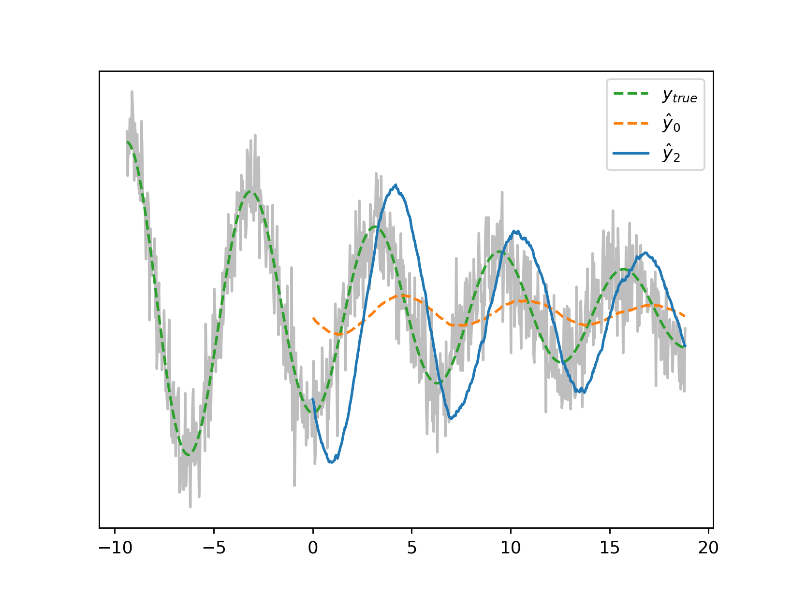
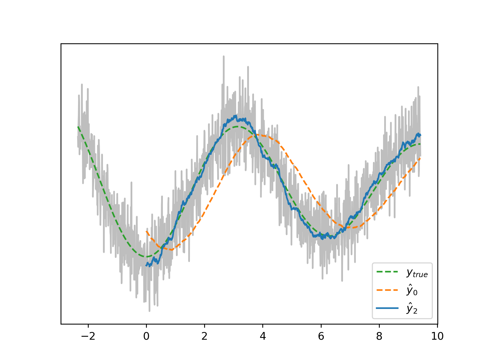
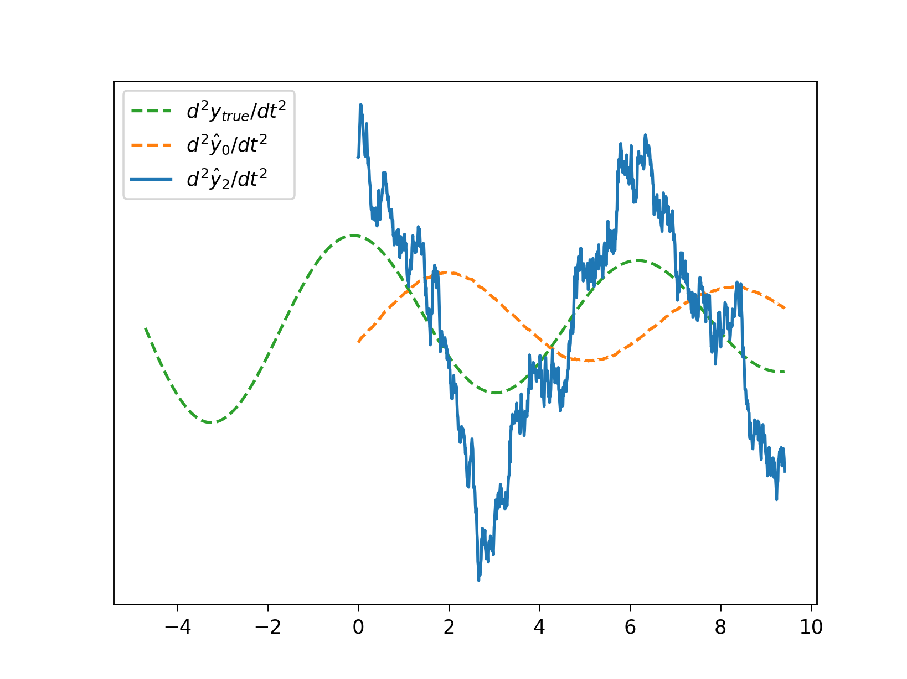
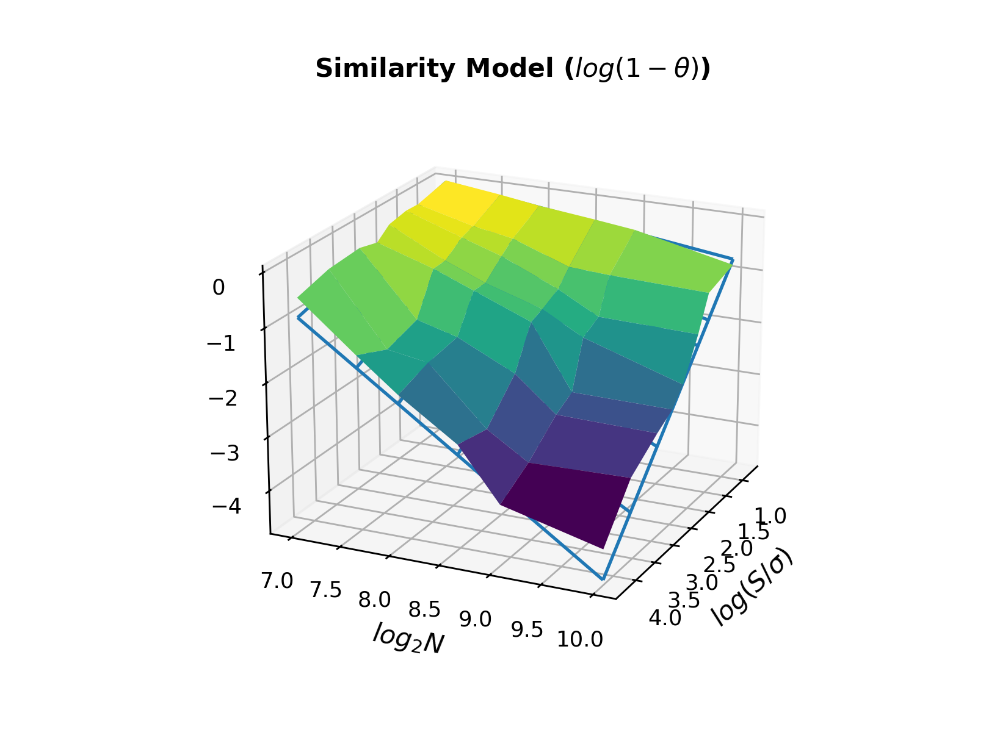

# ZDF - Considerations

A filter length `N` that is too long for your dynamics of interest will induce a phase shift that will eventually catch up with your non-minimality parameter `q`. It looks like this:


The rule of thumb, for a minimum target frequency `f`, is to ensure the filter length `L` conforms to 
$L < \frac{\mu + \kappa + 2(n+1)}{2f(\kappa + n + 1)} = \frac{1}{2f \cdot delay(n,\mu,\kappa)}$.
The value of $delay(n,\mu,\kappa)$, once the encoding has been set, is output by the helper function `./zdf -i`

An increase in the sampling frequency, if possible, may be the easiest workaround. Shown here are the zeroth and second derivatives from the [introductory section](../README.md#filtering-me-softly) where the sampling frequency has doubled:



A zero-delay second derivative is of particular interest to us as a means of calculating 'observables' such as $I = sgn(d^2y_t/dt^2) \cdot sgn(y_t - d^0y_t/dt^0)$ which in [Belov et al's](https://arxiv.org/abs/2511.01471) parlance can in turn  yield measures $<\psi_0 | I | \psi_*>$ or the degree to which the current market state reflects those where $I$ was notable. It is helpful then to grasp just how much performance degrades with increased noise and decreased filter length. 

Defining the 'similarity' $\theta$ as $\mathbb{E}[sgn(d^2\hat{y}_t/dt^2) \cdot sgn(d^2y_t/dt^2)]$ we model similarity as a function of signal-to-noise ratio and filter length:

Backing this out for a given required similarity, we output the recommended minimum filter length from a helper function. For example, for a snr of `5` and a required similarity of `0.707`:
```
./zdf -n 5,0.707
```

## Derivative Amplitudes

A sensitive topic, we have alighted on the normalization $\sum_{i}|w_i^0| / \sum_{i}|w_i^q|$ where the raw coefficients $w_i^{0,q}$ are those of the minimal and non-minimal filters respectively. Unsurprisingly, phase shifts and error levels can throw amplitudes around considerably, and may graciously be thought of as notional, potentially subject to your own renormalization. 
